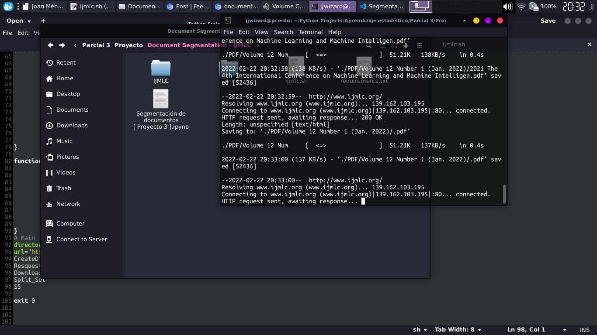

# Document Segmentation for IJMLC articles

Project for the third partial of the subject of Statistical Learning.

A bash script was created to download all pdf articles from the IJMLC.org page, converted to a text file, and split into a set of 30 articles for document segmentation analysis.

The implementation of the document segmentation was done in a notebook with the Python kernel
